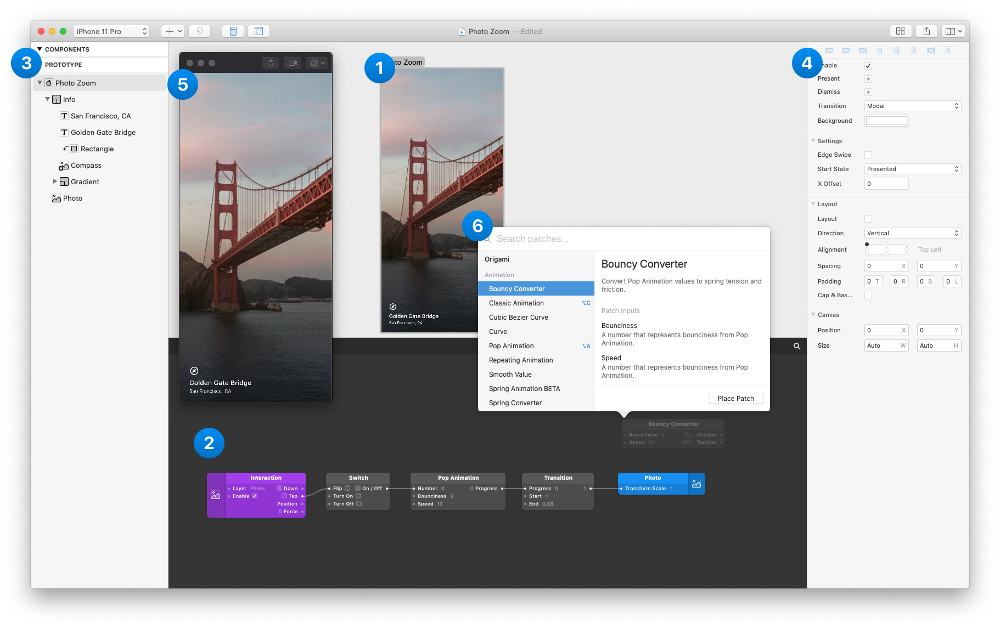

# 简介

在 Origami Studio 有 6 个主要的面板：

### 1. Canvas 画布

能够可视化地拖放和调整大小来布局你的原型。 绘制和编辑从Sketch和Figma导入的形状图层、文本、图像、视频和图层。 使用layout在画板和组中设置自适应布局，并在画板之间创建快速交互。  

### 2.Patch 编辑器

添加交互（interaction）、动画（animation）和动作（behavior）到你的原型中用的模块叫做 patch，在检查器中链接patch以输出图层属性。

### **3.**Layer List **图层列表**

原型中的图层列表，在工具栏用 `+` 按钮添加一个新的图层。想要添加一个交互到图层上，把鼠标放到图层上然后点击 Touch 按钮，从交互列表中选择，如点击，滚动，滑动。

### **4.**Inspector **检查器**

在检查器中选择一个图层并调整它的属性。

### 5.Viewer 预览

查看，交互并录制原型。

### **6.Patch 库** `⌘⏎`

查看列表中所有的 patch 和他们的描述。双击 Patch 编辑器或者用键盘快捷键打开 Patch库，然后选择一个 patch 按回车来添加 patch 到原型中。

