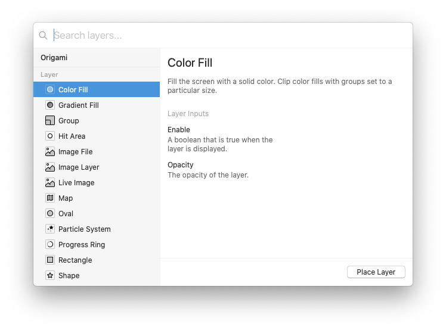

# Canvas 画布

## Artboards 画板

画板包含正在设计的每个屏幕的图层。 画板尺寸由工具栏最左端选择的“设备尺寸”确定。

## Layer Library 图层库

使用`⌘⇧N`或工具栏中的`+`按钮，弹出一个图层插入框，选择要插入的图层。 （需要说明的是，图层库与patch库并不相同）。

## Layer Properties 图层属性

图层属性类似于patch上的端口。 这些输入端口的值确定图层的外观。



