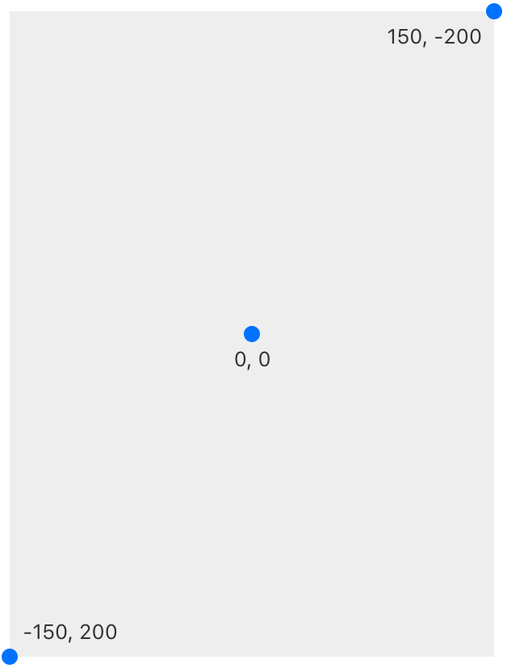
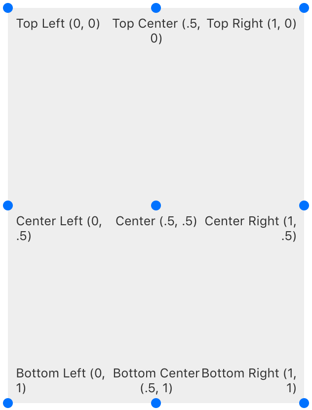
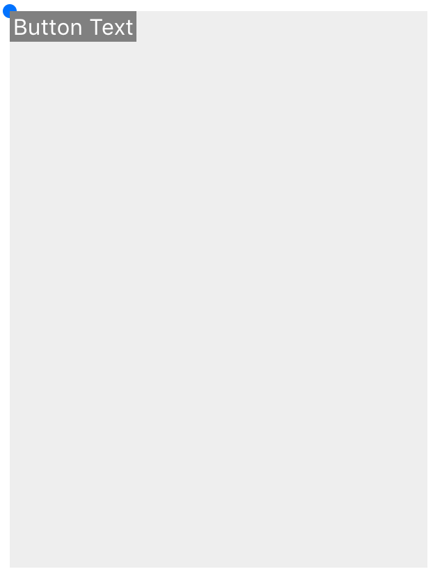
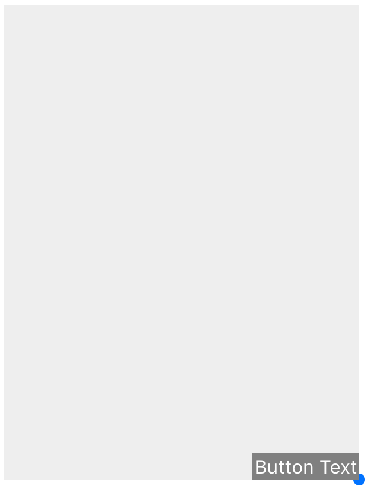
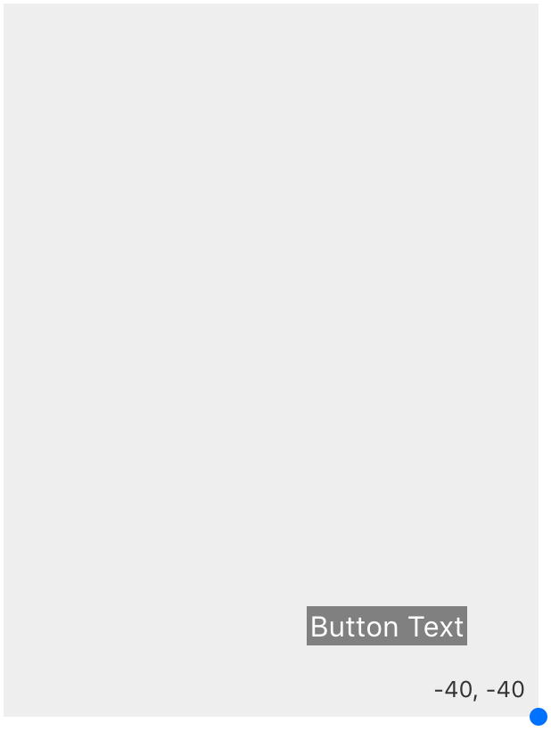
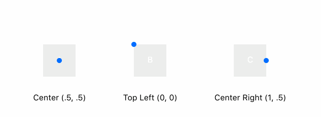

# Coordinates

Origami Studio 使用 pt\/dp 坐标单位替代了像素. 用pt\/dp来规定位置和大小，Origami 将处理渲染图层到适当的密度。比如一个iPhone 7有 375x667个点，但却是750x1334的像素。

默认情况下, 起始点 \(x: 0, y: 0\) 在屏幕中央. 在X轴, 向右是坐标增加, 向左是减少。 在Y轴, 向下是坐标增加，向上是减少。

举个例子,下面这个图层组的高度是400像素，宽度是300像素:

## 锚点

锚点改变模块坐标系的起点. 锚点能在模块编辑器里用 Point模块定义, X 和 Y 是任何0-1的小数.

这是一个文本图层的例子，它的位置从左上角的锚点开始:

从右下角:

如果你想要插入40像素，设置-40的 X Position 和 -40的 Y Position .

## 中心点

中心点关系到一个图层的缩放和选择，它是可以被改变的并且可以和锚点分开控制，中心点能够在模块编辑器里面用Point模块定义， X 和 Y 是任何0-1的小数.

