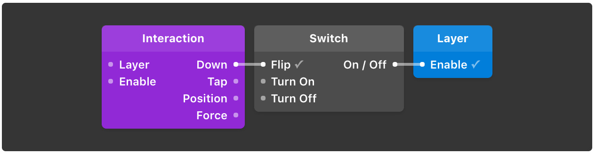
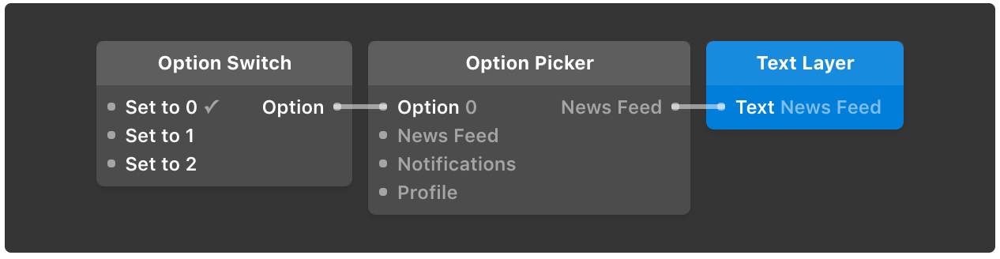
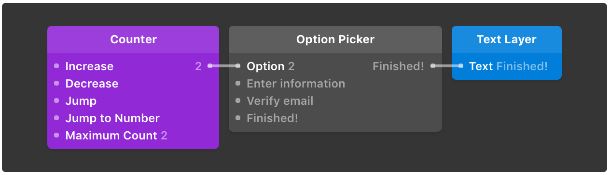

# States

每个原型都有多个状态并且能够在状态间变化. 在 Origami中, Switch 模块帮助保持追踪你的状态. 他们就像灯光的开关能被交互模块切换。

## 状态模块

### **开关** `⇧S`

Switch 模块就像灯光开关: 打开它保持开着, 和关闭它保持关着. 他们对于构建简单的两个状态的交互很有用。例如显示和隐藏弹出对话框。

多个 Switch 模块能被用逻辑模块 \(Or, And, Not\)连接以在其他模块之上创建，例如：打开一个具有不同连接选项的设计，用户可以切换。

### **选项开关**

Option Switch 模块对于不能共存的互相独有的状态很有用 例如:标签栏。 选项开关对于选项选择器依据状态传递不同的值十分常用。举个例子, 如果你想要在3个状态间切换导航栏标题。

### **计数器**

[Counter](http://origami.design/documentation/patches/builtin.counter.html) 模块对于不能共存的互相独有的状态很有用, 并且按顺序增加。 例如：一个入职流程。

## 编号数字表示状态

Switch 和 Option Switch 模块都是输出状态的数字. Switch 模块输出 0 \(off\) 或者 1 \(on\), 以及 Option Switch 模块 输出数字从0开始 作为第一个状态,到 1 位 第二个, 以此类推:

* Index 0 → Initial state \/ Off State
* Index 1 → 2nd state \/ On State
* Index 2 → 3rd state
* Index 3 → 4th state
* ...

## 总结

* 用 Switch, Option Switch, 或者 Counter管理状态
* 状态用整数表示, 从0开始

